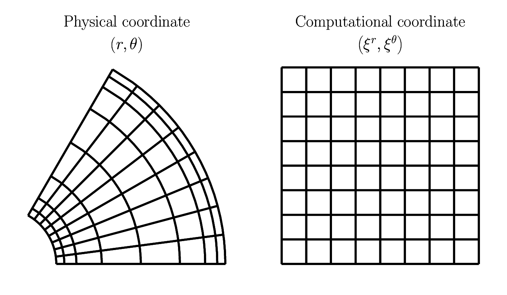

########
Equation
########

See `the CFD solver <https://github.com/NaokiHori/SimpleTCSolver>`_ for equations describing hydrodynamic laws.

In addition to the incompressibility constraint and the momentum balance which are part of the fluid-mechanical solver, we consider another relation with respect to the phase indicator function :math:`H` to capture the interfacial motions:

.. math::

   \frac{DH}{Dt}
   =
   0,

or in a strong conservation form with the assumption of the incompressibility:

.. math::

   \pder{H}{t}
   +
   \frac{1}{J}
   \pder{}{\gvr}
   \left(
      \frac{J}{\hvr}
      \ur
      H
   \right)
   +
   \frac{1}{J}
   \pder{}{\gvt}
   \left(
      \frac{J}{\hvt}
      \ut
      H
   \right)
   +
   \frac{1}{J}
   \pder{}{\gvz}
   \left(
      \frac{J}{\hvz}
      \uz
      H
   \right)
   =
   0.

Note that the equations are written in the computational coordinate systems where the grid sizes are unity whilst the basis vectors lengths vary in space.

To start, we consider its volume-integrated version for a control volume mapped to each computational cell center denoted by :math:`V`:

.. math::

    \vat{J}{\ccidx{i},\ccidx{j},\ccidx{k}} \pder{\vat{\phi}{\ccidx{i},\ccidx{j},\ccidx{k}}}{t}
    &
    =
    \vat{\left( \int \int \jhvr \ur H dS_{\gvr} \right)}{\cmidx{i},\ccidx{j},\ccidx{k}}
    -
    \vat{\left( \int \int \jhvr \ur H dS_{\gvr} \right)}{\cpidx{i},\ccidx{j},\ccidx{k}} \\
    &
    +
    \vat{\left( \int \int \jhvt \ut H dS_{\gvt} \right)}{\ccidx{i},\cmidx{j},\ccidx{k}}
    -
    \vat{\left( \int \int \jhvt \ut H dS_{\gvt} \right)}{\ccidx{i},\cpidx{j},\ccidx{k}} \\
    &
    +
    \vat{\left( \int \int \jhvz \uz H dS_{\gvz} \right)}{\ccidx{i},\ccidx{j},\cmidx{k}}
    -
    \vat{\left( \int \int \jhvz \uz H dS_{\gvz} \right)}{\ccidx{i},\ccidx{j},\cpidx{k}}.

The left-hand-side term denotes the temporal evolution of the volume-of-fluid :math:`\phi` defined as

.. math::

   \vat{\phi}{\ccidx{i},\ccidx{j},\ccidx{k}}
   \equiv
   \frac{1}{\vat{J}{\ccidx{i},\ccidx{j},\ccidx{k}}}
   \int_V H dV,

while the right-hand-side terms are the surface integral of the fluxes of :math:`H`, which are to be evaluated to update :math:`\phi`.

